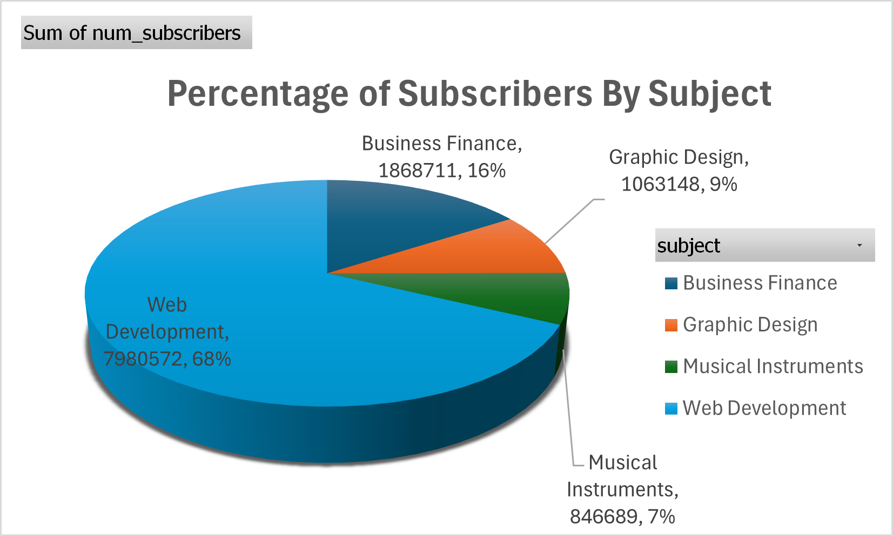
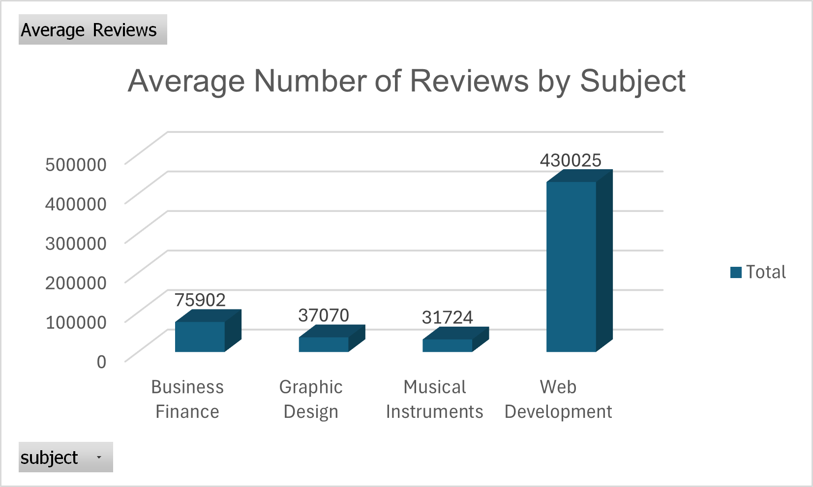
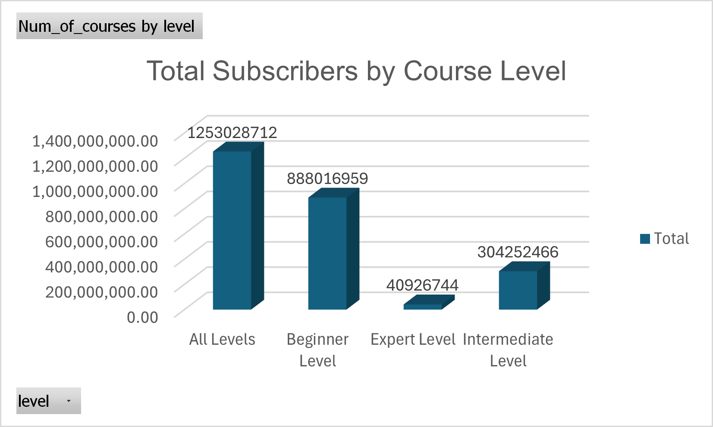

# Leaf Village Information System

A showcase project demonstrating a **realistic information system** for a private training provider.  
It includes a normalized **SQLite database**, **sample data**, **advanced SQL (constraints, triggers, analytics)**, and **charts/statistical insights**.

## What’s inside
- `database/` — ready-to-run SQLite database (`LeafVillage.db`) and full build script (`LeafVillage.sql`)
- `docs/Reports/` — two well-structured reports describing the IS plan and the database design & SQL implementation
- `docs/Charts_Analysis/` — visuals used in the analysis (bar, column, and pie charts)
- `datasets/` — public dataset used for insights (Udemy online courses)
- `src/` — placeholder for future UI/API code (optional)

## ERD & Key Features
- Normalized relational model (3NF) for Students, Staff, Courses, Enrollments, Payments, Certificates, and more.
- **Constraints & Indices** to protect integrity (e.g., unique enrollments per offering).
- **Automation via SQL triggers** (e.g., status updates on payment/certification).
- **Analytical queries** for revenue, course demand, staff load, and student engagement.
- **Excel/Power Query** charts for course popularity and distributions.

## Quick start
**Option A: Use the ready DB**  
1. Open `database/LeafVillage.db` with SQLiteStudio / DB Browser for SQLite.  
2. Browse tables and run your own queries.

**Option B: Rebuild from SQL**  
1. Create a new SQLite database.  
2. Run `database/LeafVillage.sql` to create tables and insert sample data.

## Screenshots
  
 

## Real‑world relevance
This mirrors operations of a small education provider: **enrolment workflows, payments, certificates, staffing, and reporting** — the kind of database many orgs rely on. Great for roles in **data, backend, or cybersecurity** (GDPR/ISO awareness, access control mindset).

## How this was built
- **SQLite** for schema + data + triggers
- **SQL** (DDL/DML/Queries) for implementation and insights
- **Excel + Power Query** for charts & profiling
- **ERD-first** design with iterative refinement

## Roadmap (next steps)
- Add a lightweight **web UI** (Flask/Express/PHP) to browse students, enrollments, and payments.
- Role-based login and audit logging.
- Dockerfile + seed script for one-click setup.

---

**Author:** Abuzar Taj • Email: tajabuzar0@gmail.com  
If this helped you, please ⭐ the repo!
