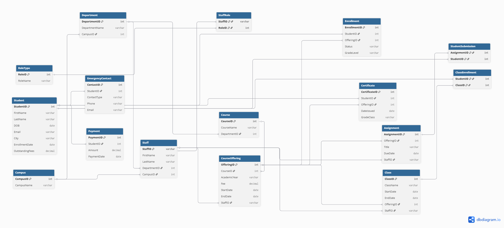
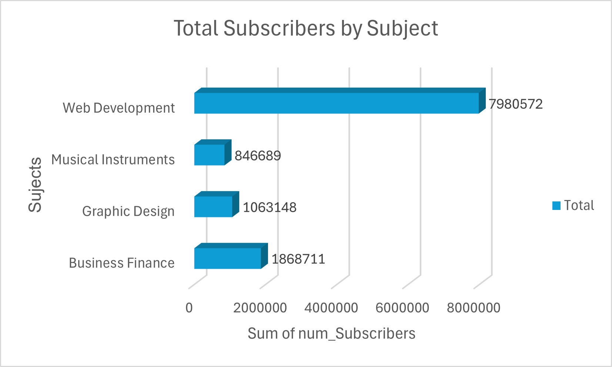

# Leaf Village Information System

A showcase project demonstrating a **realistic information system** for a private training provider.  

This project was developed as part of an academic assignment and includes:  
- A normalized **SQLite database**  
- **Sample data** for testing  
- **Advanced SQL** (constraints, triggers, integrity checks)  
- **Analytics & statistical charts** (course popularity, subscribers, levels)  
- **Reports & documentation**  

---

## 📂 Project Structure


LeafVillage-InformationSystem/
│
├── database/ # SQLite database & schema
│ ├── LeafVillage.db
│ ├── LeafVillage.sql
│
├── datasets/ # External dataset used for analysis
│ └── udemy_online_education_courses_dataset.csv
│
├── docs/
│ ├── ERD_leafVillage.png # Entity Relationship Diagram
│ └── Charts_Analysis/ # Statistical analysis & charts
│ ├── bar_chart.png
│ ├── column_chart.png
│ ├── courses_by_level_chart.png
│ └── pie_chart.png
│ └── Reports/ # Documentation & reports
│ └── Report_Part1_InformationSystem.docx
│
├── LICENSE
└── README.md
---

## 📊 Entity Relationship Diagram (ERD)

<p align="center">
  
</p>

<p align="center"><em>Figure: Normalized ERD of the LeafVillage Information System</em></p>
---

## 📈 Sample Analysis

The project includes **statistical insights** from the dataset with visualizations:

- Total subscribers by subject  
- Subscribers by course level  
- Average number of reviews by subject  
- Percentage distribution of subscribers  

<p align="center">
  
</p>
---

## 🚀 How to Run

1. Clone the repository:  
   ```bash
   git clone https://github.com/Abuzartaj/LeafVillage---InformationSystem.git

---

### Step 5: Add Features + License
```markdown
---

## 📌 Key Features
- Normalized database with **students, teachers, classes, and enrollments**  
- **Constraints** to enforce data integrity  
- **Triggers** to automate updates  
- **Analytical queries** for insights  
- Professional **ERD & reports**  

---

## 📜 License
This project is licensed under the MIT License.  
Feel free to use and modify with attribution.  

---

✨ *Developed by Abuzar Taj as part of BSc Computer Science coursework.*  


